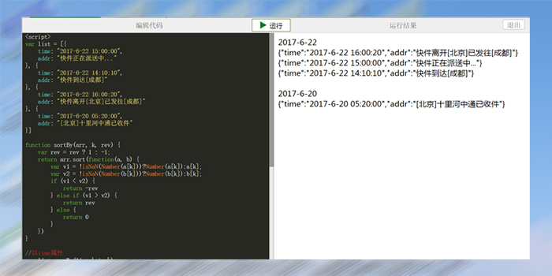

# jquery.runCode.js
代码在线编辑预览插件

**[[demo地址]](http://denghao.me/demo/2017/jquery.runCode/demo.html "demo")**

### 步骤/steps:
1. 在`<head>`头部引入jquery.runCode.css

		<link rel="stylesheet" href="./jquery.runCode.css">

2. 引入jQuery.js
 
		

3. 引入jquery.runCode.js

		

4. 把目标代码块放入容器中，（建议用textarea），并取个样式类名或id，以供选择器查找
    
	    <textarea class="playcode">
	    	<h1>哈哈哈哈</h1>
	    </textarea>

5. 调用方法

		$(".playcode").runCode();

### 可选参数/options:

| 参数名     |  默认值            |      说明               |
| --------- |:-----------------:| -------------------------:|
| watch     | false （boolean）  | 是否监听修改，以便自动运行代码 |
| width     | 96% (string)      | 弹窗宽度，单位%或px         |
| height    | 90% (string)      | 弹窗高度，单位%或px         |

**[[demo地址]](http://denghao.me/demo/2017/jquery.runCode/demo.html "demo")**

